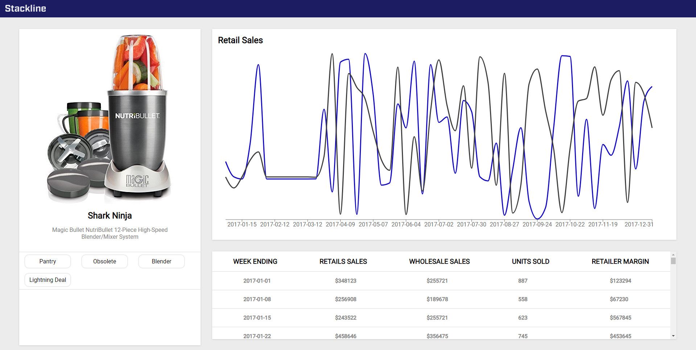

# Stackline Assessment

## Table Of Contents

- [Description](#description)
- [Deployed Application](###deployed-Application)
- [Installation](#installation)
- [Screenshots](#screenshots)
- [Technologies Used](#technologies-used)
- [Contributors](#contributors)

## Description

My product webpage created for the stackline frontend engineer assessment. Created using React and Redux.

## Deployed-Application

https://colinjhedwards.github.io/sl-assessment/

## Installation

- Clone the repository from https://github.com/ColinJhEdwards/sl-assessment.
- Cd into the correct folder and enter "npm i" to install necessary packages.
- Enter "npm start" to start the server.

## Screenshots

## Technologies-Used

- Axios
- React
- Redux
- Redux Thunk
- Styled-Components
- Recharts

## Contributors

This app brought to you by:

- Colin Edwards https://github.com/ColinJhEdwards
